# Chimera Painter Dataset Description

*   **Demo**: http://goo.gle/chimera-painter
*   **Blog**: http://goo.gle/chimera-painter-blog

[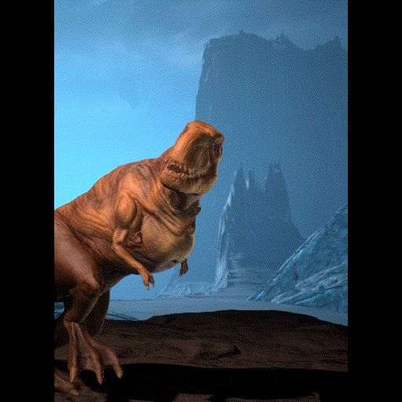]

## Overview

Dataset collection and creation is a costly and time-consuming process. We
believe that this dataset can contribute to the computer graphics and machine
learning community to develop more advanced techniques for creature and fantasy
image generation.

This dataset was used to train image-generation models for the Chimera project.
We demonstrated results in a blog post (http://goo.gle/chimera-painter-blog) and
demo (http://goo.gle/chimera-painter). When we started the project, we did an
extensive evaluation of existing datasets to see if one would meet our needs. No
existing dataset had the qualities needed to train high-quality machine learning
image-generation models for the case of fantasy creatures. While existing
photographic datasets exist, they are missing dramatic angles, viewpoints,
poses, and textures that are present in this dataset.

## What's in this?

This dataset contains 2D images created using textured 3D models in an
[Unreal Engine](https://www.unrealengine.com/) scene.

The dataset is divided into the following groups:

*   ~721K Training creature PNG images (~143 GB)
*   ~721K Training segmentation map PNG images (~3.8 GB),
*   11 Hand-drawn test segmentation map PNG images (80 KB)
*   ~2K Automatically generated test segmentation map PNG images (12 MB)

Example images from the dataset are available [here](#example-images).

## Download

The entire dataset is available as a single zip file
[here](https://storage.googleapis.com/magentadata/datasets/chimera-painter/chimera-painter-dataset.zip)
(~146.9 GB).

## Data Structure

### Training Creature / Segmentation Map images

*   Resolution: 512x512
*   Format: PNG
*   Filename convention: CreatureName-CR-#-S-#-T-#-CA-# (semantically this is
    [CreatureName](#creature-name)-[Pose](#pose)-[Scale](#scale)-[Texture](#texture)-[Camera
    Angle](#camera-angle))

#### Training Image Shape

All images contain 70 pixel wide borders on the left and right sides, making the
effective image area 512x372. The purpose of this was to fit the rectangular
border needed for the demo card game that these images were targeted for, while
also allowing for a square image for a machine learning model to train on. The
red, green, blue (RGB) border color is all uniform in both the creature images
and segmentation images at (0, 0, 0).

#### Filenames

The filename parts are described in greater detail in the following sections.

##### Creature Name

The type of creature represented in the image. There are 30 creatures in total.
There are 24,120 creature images and 24,120 segmentation images per creature,
except for the Antlion, which has only 21,708 of each type of image.

-   Antlion
-   Axolotl
-   CGazelle (Chinese gazelle)
-   Cheetah
-   Crab
-   Dino (Tyrannosaurus Rex)
-   Dragonfly
-   Fish
-   Gorilla
-   Grizzlybear
-   HBird (Hummingbird)
-   HWhale (Humpback whale)
-   Hyena
-   Insect (Wasp)
-   Lion
-   Lynx
-   Manatee
-   Mantis (Praying Mantis)
-   Mongoose
-   Moth
-   PGourmani (Pearl Gourami)
-   Porcupine
-   PWorm (Parasitic worm)
-   RDolphin (River dolphin)
-   SeaHorse
-   SIbex (Sable Ibex)
-   SNBat (Sword-nosed Bat)
-   Starling
-   Swan
-   Wolf

##### Pose

*CR-#*: A specific pose / creature combination. For example, CR-1 is a Hyena in
a "Standing Majestic" pose. While the number is unique to every animal / pose
combination, the pose themes repeat on 10 with the following pattern. (For
example, 1, 11, 21, 31, etc. would all use the "Standing Majestic" pose.)

1.  Standing Majestic
2.  Standing Aggressive
3.  Standing Defensive
4.  Sitting Majestic
5.  Sitting Aggressive
6.  Sitting Defensive
7.  Jumping 1
8.  Jumping 2
9.  Running 1
10. Running 2

##### Scale

*S-#*: How large the creature appears in the image. There are four scales for
each creature, ranging from smallest to largest.

##### Texture

*T-#*: The texture variant of the creature as applied to the original 3D model
that was used to generate this image. There are three textures per creature
type.

##### Camera Angle

*CA-#*: The camera angle that the creature image was captured at.

### Test Segmentation Map images

*   Resolution: 512x512
*   Format: PNG
*   Filename convention: [CreatureName](#creature-name)-CreatureName_# or
    CreatureName-CreatureName-CreatureName_#

#### Test Image Shape

The image shapes of the test images match the
[training images](#training-image-shape).

### Segmentation Map colors

All segmentation map images (whether training, or evaluation) use a particular
color mapping, one for each creature part supported in the dataset. There are 22
distinct colors used, which includes 20 colors for creature parts, one for the
ground color, and one color for the background of the image. The red, green,
blue (RGB) color mappings to semantic names are as follows:

Part Name        | RGB Color
:--------------: | :-------------:
Ground           | (255, 255, 255)
Background       | (0, 0, 0)
Head             | (230, 25, 75)
Muzzle           | (230, 190, 255)
Eyes             | (250, 190, 190)
Nose             | (70, 240, 240)
Mouth            | (67, 99, 216)
Teeth            | (128, 128, 0)
Ears             | (170, 255, 195)
Horns            | (117, 0, 0)
Neck             | (60, 180, 75)
Wing             | (240, 50, 230)
Torso Front      | (145, 30, 180)
Torso Back       | (0, 128, 128)
Upper Front Legs | (188, 246, 12)
Upper Back Legs  | (245, 130, 49)
Lower Front Legs | (0, 0, 117)
Lower Back Legs  | (128, 0, 0)
Foot Top         | (128, 128, 128)
Foot Bottom      | (255, 225, 25)
Claws            | (154, 99, 36)
Tail             | (255, 216, 177)

## Example Images

### Training images

File Name                          | Creature                                                                                              | Segmentation map
:--------------------------------: | :---------------------------------------------------------------------------------------------------: | :--------------:
CGazelle-CR-171_S_4_T_2_CA_136.png | 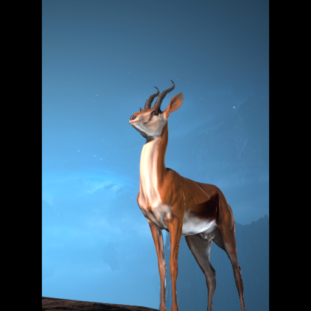 | 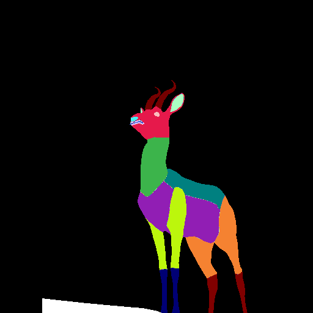
Dino-CR-91_S_2_T_2_CA_95.png       | 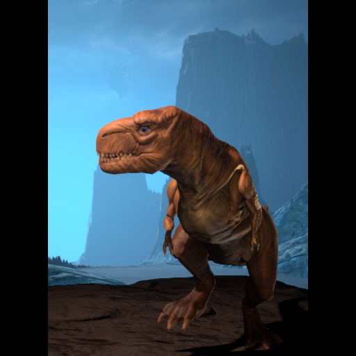                  | 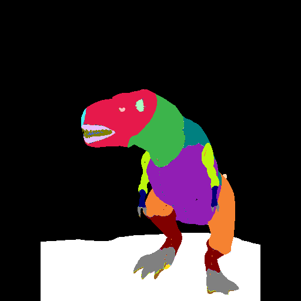
Porcupine-CR-76_S_3_T_0_CA_95.png  | 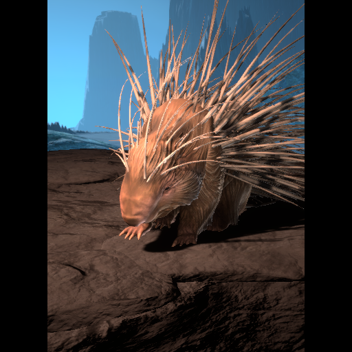        | 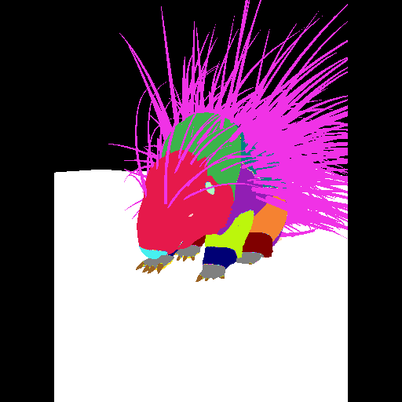

### Test images

Hand-drawn test segmentation maps

File Name                     | Segmentation map
:---------------------------: | :--------------:
SNBat-Dino-Wolf_0.png         | 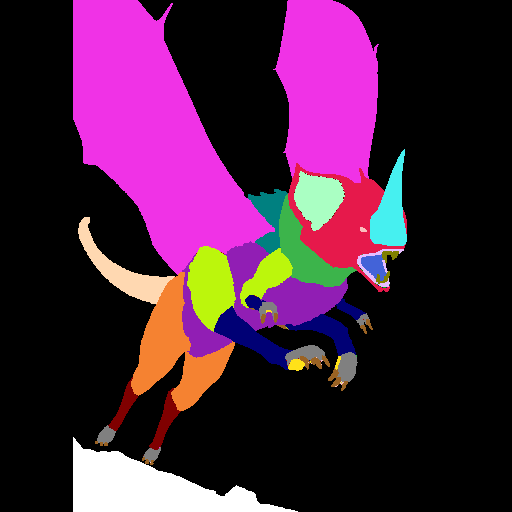
Hyena-Gorilla-Porcupine_0.png | 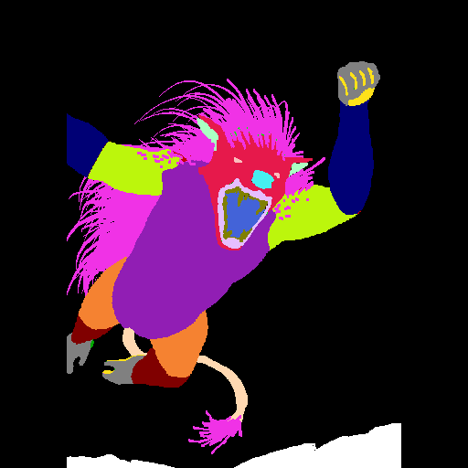
Axolotl-HWhale_0.png          | 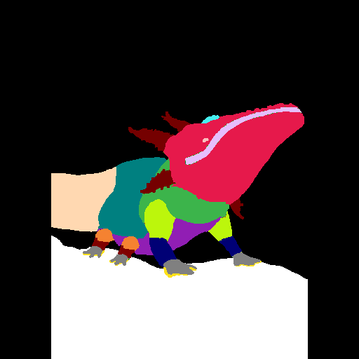

Automatically generated test segmentation maps

File Name             | Segmentation map
:-------------------: | :--------------:
Dino-Gazelle_0.png    | 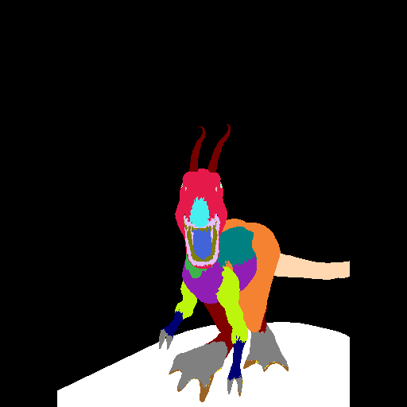
Hyena-Moth-Wolf_1.png | 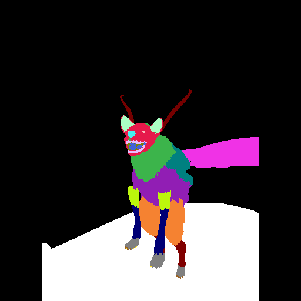
Starling-Wasp_0.png   | 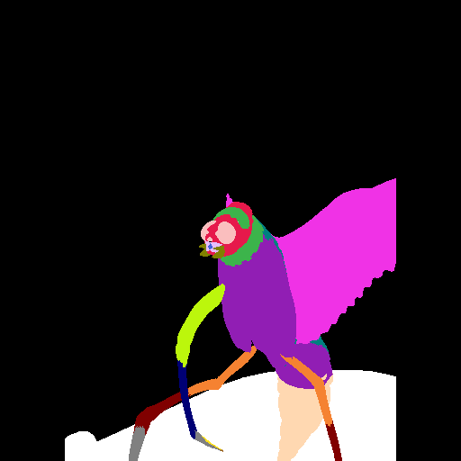

## Acknowledgements

We would like to thank Lee Dotson for his amazing contributions to this dataset
(including all of the hand-drawn test set images).
